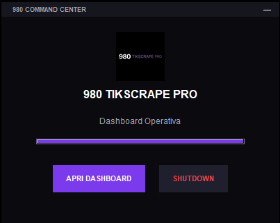
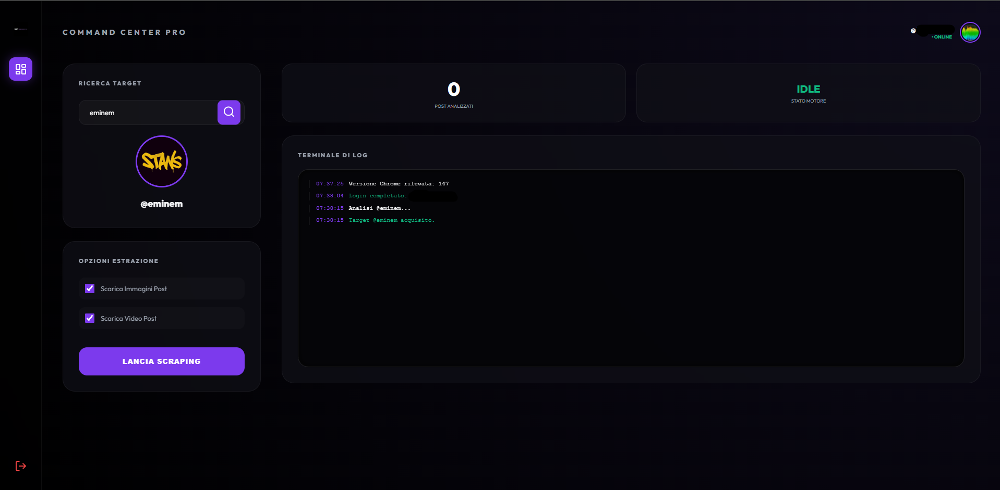

# ⚡ 980 TIKSCRAPE PRO ⚡

[]()
[]()
[]()

**980 TikScrape Pro** is a high-performance desktop application designed for advanced TikTok data extraction. It combines a robust **Anti-Detection Engine** with a dual-interface architecture: a native **Command Center** for process management and a sleek **Web Dashboard** for interactive control.

---

## 🇺🇸 Project Overview

### 🏗️ Dual-Layer Architecture
1.  **Command Center (Desktop GUI)**: A custom-built Tkinter window (400x320) that handles the application's lifecycle, boot sequence, and master shutdown.
2.  **Interactive Dashboard (Web UI)**: A FastAPI-powered responsive interface reachable at `localhost:8000`, providing real-time logs, profile previews, and extraction controls.

### 🛠️ Core Features
*   **Shadow-Bypass 2.0**: Integrated `undetected-chromedriver` technology to navigate TikTok's complex bot detection and login flows.
*   **Hybrid Extraction Engine**: Combines Mobile API emulation with universal data rehydration for high-fidelity profile and media harvesting.
*   **Multi-Format Downloader**: Simultaneous extraction of High-Definition videos (MP4) and Image Posts (JPG) with organized directory structures.
*   **Session Persistence**: Encrypted local session storage allowing one-click re-authentication.
*   **Aesthetic Excellence**: Dark-mode glassmorphism design system across both GUI and Web interfaces.

### 🚀 Build Instructions
To generate the standalone executable:
1. Ensure Python 3.10+ is installed.
2. Run the automated compiler:
   ```powershell
   .\COMPILA_980.bat
   ```
3. Locate the binary in the `dist/` directory.

---

## 🇮🇹 Presentazione Progetto

**980 TikScrape Pro** è un'applicazione desktop ad alte prestazioni progettata per l'estrazione avanzata di dati da TikTok. Unisce un **Motore Anti-Detection** con un'architettura a doppia interfaccia: un **Command Center** nativo per la gestione dei processi e una **Dashboard Web** elegante per il controllo interattivo.

### 🏗️ Architettura Dual-Layer
1.  **Command Center (Desktop GUI)**: Una finestra Tkinter personalizzata (400x320) che gestisce il ciclo di vita dell'app, la sequenza di boot e lo spegnimento globale.
2.  **Dashboard Interattiva (Web UI)**: Un'interfaccia responsive basata su FastAPI accessibile a `localhost:8000`, con log in tempo reale, anteprime dei profili e controlli di estrazione.

### 🛠️ Caratteristiche Principali
*   **Shadow-Bypass 2.0**: Tecnologia `undetected-chromedriver` integrata per superare i sistemi anti-bot e i flussi di login di TikTok.
*   **Hybrid Extraction Engine**: Combina l'emulazione delle API Mobile con il re-hydration dei dati universali per un'acquisizione fedele di profili e media.
*   **Downloader Multi-Formato**: Estrazione simultanea di video HD (MP4) e Post Immagine (JPG) con organizzazione automatica delle cartelle.
*   **Persistenza Sessioni**: Archiviazione locale delle sessioni per ri-autenticazione rapida con un click.
*   **Design Premium**: Sistema estetico basato su dark-mode e glassmorphism applicato a tutte le interfacce.

---

## ⚖️ Disclaimer / Avvertenze
This tool is for research and data analysis purposes only. The author is not responsible for any misuse. Respect platform TOS and privacy laws.  
*Questo strumento è per soli scopi di ricerca e analisi. L'autore non è responsabile per usi impropri. Rispetta i termini di servizio e le leggi sulla privacy.*

---

## 📸 Visual Documentation


### 🔒 GUI - Command Center


### 📊 Web Dashboard


---
*Developed with 💜 by 980 Labs.*

